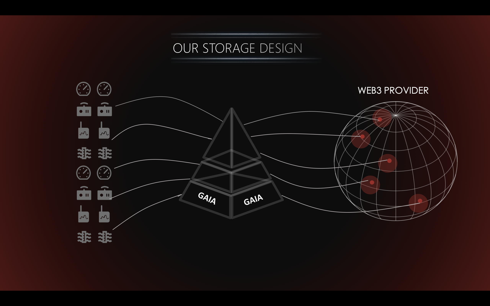

# Gaia-Provider(web3) 

> A simple Vue.js project using Gaia&web3 provider built for the decentralized web.





## Build Setup
``` bash
# install dependencies
# previously we used yarn install. This is no longer supported.
npm install

# Compiles and hot-reloads for development
npm run serve

# Compiles and minifies for production
npm run build
```
## Linting & Unit test

``` bash
# Lints and fixes files
npm run lint

# Run your unit tests
npm run test:unit
```

